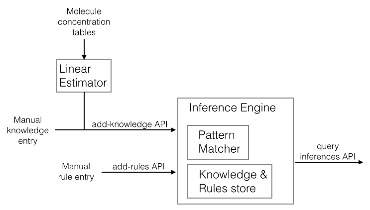

# Symbolic representation and logical inference of knowledge from scientific publications

<h2>Table of Contents</h2>

<ul>
<li><a href="#sec-1">1. Introduction</a></li>
<li><a href="#sec-2">2. System design</a>
<ul>
<li><a href="#sec-2-1">2.1. Data structures</a>
<ul>
<li><a href="#sec-2-1-1">2.1.1. Knowledge</a></li>
<li><a href="#sec-2-1-2">2.1.2. Rules</a></li>
</ul>
</li>
<li><a href="#sec-2-2">2.2. API</a></li>
<li><a href="#sec-2-3">2.3. Inference engine</a></li>
<li><a href="#sec-2-4">2.4. Inferences by pattern matching</a></li>
<li><a href="#sec-2-5">2.5. Linear estimator</a></li>
</ul>
</li>
<li><a href="#sec-3">3. Experiments on finding from cancer biology</a></li>
<li><a href="#sec-4">4. Future work</a>
<ul>
<li><a href="#sec-4-1">4.1. Conflicts</a></li>
<li><a href="#sec-4-2">4.2. Context-predicates</a></li>
<li><a href="#sec-4-3">4.3. How-related?</a></li>
<li><a href="#sec-4-4">4.4. How-trusted?</a></li>
<li><a href="#sec-4-5">4.5. Most-important?</a></li>
</ul>
</li>
<li><a href="#sec-5">5. Conclusion</a></li>
<li><a href="#sec-6">6. References</a></li>
<li><a href="#sec-7">7. Appendix A</a>
<ul>
<li><a href="#sec-7-1">7.1. Wnt signaling pathway</a></li>
<li><a href="#sec-7-2">7.2. TGF-Beta Pathway</a></li>
<li><a href="#sec-7-3">7.3. DNA Damage sensing pathway</a></li>
<li><a href="#sec-7-4">7.4. Death factor pathway</a></li>
<li><a href="#sec-7-5">7.5. Cytokine Pathway</a></li>
<li><a href="#sec-7-6">7.6. Survival Factor Pathway</a></li>
<li><a href="#sec-7-7">7.7. Hormone Pathway</a></li>
<li><a href="#sec-7-8">7.8. Growth factor pathway</a></li>
<li><a href="#sec-7-9">7.9. ECM Pathway</a></li>
</ul>
</li>
</ul>

<a name="sec-1"/>

# Introduction

The majority of existing scientific knowledge is contained within scientific journals, but its structure is obfuscated from facile computation by the complications of natural language. As such, the ability to automatically parse information from the existing set of knowledge is  hampered. The focus of this project is to investigate methods of representing and computing on scientific knowledge in a symbolic fashion, using the genetic pathways of significance in cancer biology as a model.

One can imagine a world in which scientific literature was written&#x2014;or at the very least, tagged&#x2014;in a machine readable format. In such a world, analysis of science spanning journals&#x2014;and even fields&#x2014;could be conducted computationally. In such a world, researchers could eschew navigating the literature and instead directly surf the scientific landscape. Existing literature could be queried directly, allowing rapid identification of what is known, what is not known, what could be known with existing techniques, and what the most potentially impactful future directions for research are.

As symbolic programming seems seems well-suited for such a challenge, we set out to implement a symbolic vocabulary and computation engine for scientific literature, inspired by the work in [6]. Our system is able to (1) infer causal relationships from raw biological data, (2) logically infer new relationships, and (3) make that data available for quick and intuitive human interaction, or “science surfing.”

<a name="sec-2"/>

# System design

As shown in the system diagram, below, our implemented system includes

1.  Biology knowledge and rules data sets,

2.  A pattern matcher that infers new data from the existing knowledge data set using the supplied list of logical relationships,

3.  An inference engine that connects the user-facing knowledge and rules APIs to the internal structures, namely the pattern matcher and internal knowledge and rules representations, and

4.  A linear estimator that is capable of generating new causal relationships based on tables of experimental molecular concentration data.

To better explain our system's function, consider the following toy example: When supplied with the tables of toy experimental data in the table below, our linear estimator infers the relationships

>     '(CAUSE X Y)
>     '(CAUSE Y Z)

and logically infers the relationship

>     '(CAUSE X Z).

<table id="tab:toy-data" border="2" cellspacing="0" cellpadding="6" rules="groups" frame="hsides">
<caption align="above">Table 1: Example experimental data, used by the linear estimator to infer new causal relationships.</caption>

<colgroup>
<col  class="right" />

<col  class="right" />

<col  class="left" />

<col  class="right" />

<col  class="right" />
</colgroup>
<thead>
<tr>
<th scope="col" class="right">Molecule X (nM)</th>
<th scope="col" class="right">Molecule Y (nM)</th>
<th scope="col" class="right">Molecule Y (nM)</th>
<th scope="col" class="right">Molecule Z (nM)</th>
</tr>
</thead>

<tbody>
<tr>
<td class="right">59</td>
<td class="right">350</td>
<td class="right">560</td>
<td class="right">3</td>
</tr>

<tr>
<td class="right">34</td>
<td class="right">459</td>
<td class="right">485</td>
<td class="right">13</td>
</tr>

<tr>
<td class="right">26</td>
<td class="right">684</td>
<td class="right">283</td>
<td class="right">58</td>
</tr>

<tr>
<td class="right">12</td>
<td class="right">798</td>
<td class="right">54</td>
<td class="right">205</td>
</tr>
</tbody>
</table>

We can then query our knowledge for higher-order relationships, such as:

>     (is-true? '(CAUSE X Z))

Which will output that the statement is, indeed, correct, and will also output the relevant metadata for the literature used in the induction.

In our system, we focus on the relationships `CAUSE` and `BLOCK`, but the system is extensible to handle other rules such as `UP-REGULATE`, `INVOLVES`, `ON-SAME-PATHWAY`, etc.

<a name="sec-2-1"/>

## Data structures

We have two data files: knowledge and rules. Both are in a list of list structure. List elements are unique; no duplicates are allowed. Knowledge can be entered manually or deduced from tables of molecular concentration data. Rules have to be entered manually.

<a name="sec-2-1-1"/>

### Knowledge

Each piece of knowledge is made of three parts:

1.  A clause indicated the type of relationship

2.  A list of arguments (such as `moleculeA`, `moleculeB`)

3.  a context, which includes metadata about the source of the knowledge, such as the author of the paper, the data of publication, and the journal.  The context of inferred statements includes which statements that led to that inference (like a "taint").

Knowledge directly annotated from scientific literature, in this case a subset of the TGF&beta; pathway, is as follows:

>     ;; TGF-Beta Pathway
>     '(CAUSE (TGF-Beta TGF-Beta-R TGF-Beta:TGF-Beta-R) tgfb-context)
>     '(BLOCK (Cyclin-D:CDK4 Rb) tgfb-context)
>     '(BLOCK (HPV-E7 Rb) tgfb-context)

To further illustrate our data structures, the context for the paper from which the above relationships were identified is as follows:

>     (define tgfb-context
>       (list
>        (cons "title" "TGF-Beta signaling from [...] through SMAD proteins.")
>        (cons "author" "Heldin, C., Miayazono, K., and Dijke, P.")
>        (cons "year" "1997")
>        (cons "university" "Ludwig Institute for Cancer Research")
>        (cons "topic" "Cell biology")
>        (cons "journal" "Nature")
>        (cons "pubmed" "9393997")
>        (cons "locations" (list "loc_a1" "loc_b1"))))

1.  Compound object aliases

    We allowed for user-defined molecule families in our system. For example, a user might create an umbrella group `“Cyclins”` composed of the cyclin molecules, in this way:

    >     (define compound_obj_aliases
    >       '((cons "Cyclins" (list 'Cyclin-D 'Cyclin-E))))

    Using this alias, the user could reference the `“Cyclins”` group rather than specifying individual members of the group. For example, the following two queries would return the same result:

    >     (is-true? ‘CAUSE ‘Cyclin-D ‘Changes-in-gene-expression)
    >     (is-true? ‘CAUSE “Cyclins” ‘Changes-in-gene-expression)

    We modified GJS’s pattern matcher so that whenever it does element-to-element equality tests, it searches the alias definitions whenever it compares a symbol, which represents a single molecule or entity, to a string, which represents a set of related objects. This code is at the top of `matcher.scm` in the procedure `match:special-equal?`.

<a name="sec-2-1-2"/>

### Rules

Each rule is made of:

-   A set of matching patterns - these must be matched by existing statements, and

-   A "rewrite rule" used to generate a new knowledge statement.

Examples of rules include:

>     ;; Rule 1: (a -> b) + (b -> c) -> (a -> c)
>     (cons
>      (list '(CAUSE (? a) (? b))
>            '(CAUSE (? b) (? c)))
>      '(CAUSE (? a) (? c)))
>
>     ;; Rule 4: (a -| b) + (b -> c) -> (a -| c)
>     (cons
>      (list '(BLOCK (? a) (? b))
>            '(CAUSE (? b) (? c)))
>      '(BLOCK (? a) (? c)))

<a name="sec-2-2"/>

## API

The API can be grouped into (1) functions for adding knowledge, rules, and aliases to the system and (2) functions for making inferences and querying the knowledge.

API for adding knowledge, rules, and aliases to the engine:

>     (ie:init)
>     (ie:add-knowledge knowledge)
>     (ie:add-aliases new-aliases)
>     (ie:add-rules new-rules)

API for making inferences and querying the knowledge:

>     (ie:infer context_predicate)
>     (ie:is-true statement context_predicate)
>     (ie:print-knowledge)

Context predicates are not currently supported. See section 4.2 for how they could be used.

<a name="sec-2-3"/>

## Inference engine

The inference engine takes a set of knowledge and a set of rules and makes inferences by applying the set of rules as many times as possible to the knowledge to obtain new statements. These "inferred statements" are added to the existing set of knowledge, and the rules are again applied against the growing set of knowledge until no new inferences can be made.

The code for the inference engine is in `inference_engine.scm`. Here is an example of how the user would interact with the system:

>     ; load knowledge and rules from scientific publications
>     ; the data is included with the code
>     (load "data/cancer_biology/knowledge.scm")
>     (load "data/cancer_biology/rules.scm")
>
>     ; add them to the engine
>     (ie:add-knowledge knowledge)
>     (ie:add-aliases compound_obj_aliases)
>     (ie:add-rules rules)
>
>     ; ask the system whether a statement is true,
>     ; which causes it to make inferences and respond
>     ; Question: “Is it true that p15 causes cell proliferation?”
>     (ie:is-true '(CAUSE (p15 cell-proliferation)) '())
>
>     ; The system responds “Yes it is true”
>     ; and explains how it got to that inference.
>     TRUE
>     Your statement is correct and was inferred from the following 2 statements:
>     (cause
>       (p15 cell-proliferation)
>       (("inferred_from"
>         cause
>         (p15 changes-in-gene-expression)
>         (("inferred_from"
>           cause
>           (p15 rb)
>           (("inferred_from" block
>                             (p15 cyclin-d:cdk4)
>                             tgfb-context
>                             block
>                             (cyclin-d:cdk4 rb)
>                             tgfb-context))
>           cause
>           (rb changes-in-gene-expression)
>           (("inferred_from" block
>                             (rb e2fs)
>                             tgfb-context
>                             block
>                             (e2fs changes-in-gene-expression)
>                             tgfb-context))))
>         cause
>         (changes-in-gene-expression cell-proliferation)
>         (("inferred_from" cause
>                           (changes-in-gene-expression cyclin-e:cdk2)
>                           tgfb-context
>                           cause
>                           (cyclin-e:cdk2 cell-proliferation)
>                           tgfb-context)))))

The output shows that

>     '(CAUSE (p15 cell-proliferation))

was inferred from two other statements, which were each inferred from other statements. Whenever an inference is made, its context will contain the statements that led to it. The context of the non-inferred statements usually describes the original source of the statement. For example, `tgfb-context` is defined as the following:

>     (define tgfb-context
>       (list
>        (cons "title" "TGF-Beta signaling from [...] through  SMAD proteins.")
>        (cons "author" "Heldin, C., Miayazono, K., and Dijke, P.")
>        (cons "year" "1997")
>        (cons "university" "Ludwig Institute for Cancer Research")
>        (cons "topic" "Cell biology")
>        (cons "journal" "Nature")
>        (cons "pubmed" "9393997")
>        (cons "locations" (list "loc_a1" "loc_b1"))))

<a name="sec-2-4"/>

## Inferences by pattern matching

To make inferences, the inference engine runs the pattern matcher. Given a set of knowledge and a set of rules, the pattern matcher tries to apply the rules to the existing knowledge. Whenever it finds a new statement that could be added to the knowledge based on a rule, it calls a callback.

Whenever the user starts the inference process by calling ie:infer, the inference engine runs the pattern matcher by calling the `pm:match` procedure and supplies a callback that adds new rules to the existing set of knowledge:

>     (define (ie:infer context_predicate)
>       ; create the callback
>       (define (on_match knowledge matched_statements new_statement)
>        ; according to some rule, “matched_statements => new_statement”
>        ; generate a knowledge object
>        ; include the source statements that led to the inference
>        ;   in the “inferred_from” field
>         (let* ((new_type (car new_statement))
>                (new_args (cdr new_statement))
>                (new_knowledge
>                 (list new_type new_args
>                       (list
>                        (cons "inferred_from" matched_statements)))))
>                         ; add the new knowledge to the existing knowledge
>                         ; if it doesn’t already exist
>           (ie:add-knowledge-in-place new_knowledge)))
>            ; run the matcher and supply the callback
>       (pm:match all-knowledge all-rules on_match
>                 all-compound_obj_aliases))

The code for the pattern matcher is in `pattern_matcher.scm`. The `pm:match` procedure appears as follows:

>     (pm:match knowledge rules on_match_handler aliases)

The procedure `pm:match` matches the set of knowledge against each rule using `pm:match-multiple`. Whenever it finds a match, it calls the `on_match_handler` supplied by the inference engine. The `on_match_handler` is a procedure of 3 arguments:

1.  `knowledge`, a reference to the existing set of knowledge,

2.  `matched_statements`, the statements that matched the matching patterns of the rule,

3.  `new_statement`, the statement generated by the rewrite rule.

Each rule in the rules argument is a rule that contains:

1.  A set of matching patterns; these must be matched by existing statements,

2.  A "rewrite rule" used to generate a new knowledge statement.

Rules usually have multiple patterns in them. The `pm:match-multiple` procedure tries to match each pattern in the list with  a separate statement while maintaining the same variable bindings across patterns. For example, given the rule

>     '((CAUSE (? a) (? b)) (CAUSE (? b) (? c)))

The `(? b)` in the statement that matches the first pattern must be the same as the `(? b)` in the statement that matches the remaining patterns. The procedure `pm:match-multiple` matches all the patterns for only a single rule. The signature of `pm:match-multiple` is:

>     (pm:match-multiple knowledge patterns dict matched_statements cont)

The procedure `pm:match-multiple` works by repeatedly making calls GJS's `match:combinators` to match each of the patterns. If it finds matches for all the patterns, it returns the result of executing cont, the success continuation. cont is a procedure that takes the dictionary of variable bindings and a list of `matched_statements`.

When `pm:match` calls `pm:match-multiple`, it `pm:match` supplies the following success continuation:

>     (define (cont-match-multiple newdict matched_statements)
>       (let ((new_statement
>              (pm:sub-dict-into-pattern newdict new_statement_pattern)))
>         (on_match_handler knowledge matched_statements
>                           new_statement)
>         #f))

When `pm:match-multiple` succeeds, it will execute `cont-match-multiple`, which will generate a new statement by substituting the variable bindings into the “rewrite pattern” of the rule. It then calls, the `on_match_handler` supplied by the inference engine, which will add the new knowledge to the existing set of knowledge. Finally, the success continuation returns `#f` to force backtracking so that `pm:match-multiple` will find all the possible new statements implied by a given rule.

The procedure `ie:infer` continues to run until no new knowledge can be generated. At that point, all inferences have been made and the user can query the new knowledge.

<a name="sec-2-5"/>

## Linear estimator

The linear estimator takes a table of molecule concentrations (stored in a text file) and generates a knowledge statement. The table must have 2 columns, one for each molecule. The first row contains the molecule names; the other rows contain their concentrations. For example:

<table border="2" cellspacing="0" cellpadding="6" rules="groups" frame="hsides">

<colgroup>
<col  class="right" />

<col  class="right" />
</colgroup>
<thead>
<tr>
<th scope="col" class="right">Molecule A (nM)</th>
<th scope="col" class="right">Molecule B (nM)</th>
</tr>
</thead>

<tbody>
<tr>
<td class="right">1</td>
<td class="right">50</td>
</tr>

<tr>
<td class="right">2</td>
<td class="right">40</td>
</tr>

<tr>
<td class="right">3</td>
<td class="right">30</td>
</tr>

<tr>
<td class="right">4</td>
<td class="right">20</td>
</tr>

<tr>
<td class="right">5</td>
<td class="right">10</td>
</tr>
</tbody>
</table>

The linear estimator calculates the correlation of `A` and `B` and outputs a knowledge statement for "A blocks B" or "A causes B" by thresholding the correlation. The correlation is the slope of the linear regression line for `A` and `B`. That knowledge can be fed directly to the inference engine. The linear estimator gives the user the ability to input tables directly from scientific publications and make inferences on them.

<a name="sec-3"/>

# Experiments on finding from cancer biology

We chose cancer biology as a model system for our system. We chose cancer biology not only because of its importance as a field, but also because it is an expansive, multidisciplinary area of study which involves an expansive network of important causal relationships, only a small subset of which can be discussed in individual papers.

In particular, we choose to focus on the genetic networks of significance in cancer biology. We therefore conducted a literature search in this area, and identified several “hallmarks” of cancer (and ). These hallmarks are phenotypic&#x2013;that is, they are classes of cellular responses or activities&#x2013;that are induced by a complicated web of genetic interactions. The hallmarks we focused on, from , are:

1.  Sustain Proliferative Signaling

2.  Evading Growth Suppressors

3.  Resisting Cell Death

4.  Enabling Replicative Immorality

5.  Inducing Angiogenesis

6.  Activating Invasion and Metastasis

We chose to represent the underlying genetic networks as circuit diagrams, with each genetic element either inducing or repressing the other genetic elements it is wired to. We clustered these networks loosely into the pathways they most frequently are associated with in literature, and encoded each network with a minimum number of causal relationships. We also included a small number of non-molecular circuit inputs and outputs, namely circuit 'outputs' or results:

-   Gene Expression

-   Cell Proliferation (Cell cycle)

-   Cell Death (Apoptosis)

As well as circuit non-molecular inputs:

-   DNA Damage Sensor

-   Abnormality Sensor

-   Other cells

The relationships used are captured in the stylized diagram above (see references) and outlined explicitly in Appendix A.

Note that, as discussed above, these relationships need not be explicitly entered&#x2013;our program can infer these causal relationships from tables of experimental biological data. As an example, observe in Figure \ref{fig:cell-image} that the signaling molecule `p15` blocks the compound molecule `Cyclin-D:CDK4`, or

>     (‘BLOCK (p15 Cyclin-D:CDK4) ‘()).

This relationship can be entered explicitly, or can be inferred automatically from the below example experimental data:

This relationship can be entered explicitly, or can be inferred automatically from the below example experimental data:

<table border="2" cellspacing="0" cellpadding="6" rules="groups" frame="hsides">

<colgroup>
<col  class="right" />

<col  class="right" />
</colgroup>
<thead>
<tr>
<th scope="col" class="right">p15 (nM)</th>
<th scope="col" class="right">Cyclin-D:CDK4 (nM)</th>
</tr>
</thead>

<tbody>
<tr>
<td class="right">86</td>
<td class="right">23</td>
</tr>

<tr>
<td class="right">63</td>
<td class="right">34</td>
</tr>

<tr>
<td class="right">41</td>
<td class="right">45</td>
</tr>

<tr>
<td class="right">22</td>
<td class="right">58</td>
</tr>

<tr>
<td class="right">15</td>
<td class="right">89</td>
</tr>
</tbody>
</table>

<a name="sec-4"/>

# Future work

<a name="sec-4-1"/>

## Conflicts

The current system does not support detecting conflicts. We could transition our knowledge store (currently just a list of statements) into something that resembles a truth management system. This would allow us to have multiple views of the truth.

<a name="sec-4-2"/>

## Context-predicates

The `ie:infer` procedure takes a `context_predicate` argument which is not currently used. `context_predicate` would be a procedure that takes in one argument, the context of the statement, and returns whether or not the statement should be included while making inferences. The `context-predicates` would allow users to filter knowledge by its metadata, which includes the authors, journals, subjects, year of publication.

<a name="sec-4-3"/>

## How-related?

This procedure would provide a way to query the knowledge structure for the relationship between two objects. For example, if molecule `MolA` causes the presence of molecule `MolB`, then `(how-related? ‘MolA ‘MolB)` would return `('CAUSE 'MolA 'MolB)`.

This procedure could also be extended to higher-order relationships or degrees of seperation. For example, if `MolA` causes `MolB` which causes `MolC`, the `how-related?` procedure could return the entire chain of relatedness, or, perhaps, the shortest path between the two.

<a name="sec-4-4"/>

## How-trusted?

The procedure `how-trusted?` would provide a way to query the trustworthy-ness of an input relation. The output of this procedure would be a quantitative representation of the accuracy of the input action statement, which can be derived using the number of times that statement appears in the scientific source, or the credibility of the author or journal in which the statement was drawn from (this author or journal credibility could feasibly be deduced from application of a PageRank-like algorithm to the scientific citation network).

<a name="sec-4-5"/>

## Most-important?

This procedure would provide the `<number>` most important pathways or objects in a given object. The important-ness of an object could be inferred by the number of statements that rely on its value, the number of times the relation is used to make inferences by the pattern matcher, or by a PageRank-like algorithm, with the hyperlink-equivalents being causal relationships (rather than citations, as in the above section).

<a name="sec-5"/>

# Conclusion

Based on our experience, the flexibility of symbolic programming is well aligned with the requirements of an scientific knowledge computation engine. The ability to quickly navigate existing scientific knowledge is lacking, and an engine such as ours could be of substantial influence if deployed in the real-world. This impact could be magnified if our engine is combined with mechanisms for identifying potentially high impact-research.

Although we foresee bottlenecks in pattern matching&#x2013;and also anticipate that knowledge-searching on very large data sets will require significant computational resources (although this could be mitigated with intelligent pre-processing)&#x2013;our work serves as a minimal proof-of-concept implementation, and suggests that the development of such a system is feasible.

<a name="sec-6"/>

# References

1.  Hanahan, D., and Weinberg, R.A. (2000). The Hallmarks of Cancer. Cell 100, 57-70.

2.  Hanahan, D., and Weinberg, R.A. (2011). The Hallmarks of Cancer: The Next Generation. Cell 144, 646-674.

3.  Heldin, C., Miayazono, K., and Dijke, P. (1997). TGF-Beta signalling from cell membreane to nucleus through SMAD proteins.

4.  Huelsken, J., and Juergen, B. (2000). The Wnt signalling pathway. J. Cell Sci. 113, 3545.

5.  Muller, H., et al. (2001). E2Fs regulate the expression of genes involved in differentiation, development, proliferation, and apoptosis. Genes Dev., 15(3): 257-285.

6.  Wertheimer, Jeremy. *Reasoning from experiments to causal models in molecular cell biology*. (Doctoral dissertation). MIT, 1996.

<a name="sec-7"/>

# Appendix A

Note that in the following subsections, an underline indicates an alias for a family of molecules, while **bold** indicates a non-molecular input or output.

<a name="sec-7-1"/>

## Wnt signaling pathway

Relations:

-   WNT + Frizzled -> WNT:Frizzled

-   WNT:Frizzled -> Dishevelled

-   Dishevelled -> GSK-3Beta

-   GSK-3Beta -> APC

-   APC -> Beta-Cetenin

-   Other-cell + E-Cadherin -> Beta-Catenin

-   Beta-Catenin + TCF -> Beta-Catenin:TCF

-   Beta-Catenin:TCF -> **Changes-in-Gene-Expression**

<a name="sec-7-2"/>

## TGF-Beta Pathway

Relations:

-   TGF-Beta + TGF-Beta-R -> TGF-Beta:TGF-Beta-R

-   TGF-Beta:TGF-Beta-R -> SMADs

-   SMADs -> p15

-   Cyclin-D + CDK4 -> Cyclin-D:CDK4

-   p16 -| Cyclin-D:CDK4

-   p15 -| Cyclin-D:CDK4

-   Cyclin-D:CDK4 -| Rb

-   HPV-E7 -| Rb

-   Rb -| E2Fs

-   E2Fs -| **Changes-in-gene-expression**

-   SMADs -> p27

-   Cyclin-E + CDK2 -> Cyclin-E:CDK2

-   p27 -| Cyclin-E:CDK2

-   Cyclin-E:CDK2 -> **Cell-Proliferation**

-   **Changes-in-gene-expression** -> Cyclin-E:CDK2

-   SMADs -> p21

-   Cyclin-E + CDK2 -> Cyclin-E:CDK2

-   p21 -| Cyclin-E:CDK2

<a name="sec-7-3"/>

## DNA Damage sensing pathway

Relations:

-   p53 -> p21

-   p53 -> Bax

-   p53 -> **Changes-in-gene-expression**

-   **Changes-in-gene-expression** -> ARF

-   ARF -| MDM2

-   MDM2 -| p53

-   Bax -> Mitochondria

-   Mitochondria + (not Bcl2) -> **Apoptosis**

<a name="sec-7-4"/>

## Death factor pathway

Relations:

-   FasL + Fas + (not FAP) + (not Decoy-Fas) -> FADD

-   FADD -> Caspase8

-   Caspase8 -> Bid

-   Caspase8 -> **Apoptosis**

-   Bid -> Mitochondria

-   **Abnormality-sensor** -> Bim

-   Bim -> Mitochondria

-   Mitochondria + (not Bcl2) + (not BclXL) -> CytochromeC

-   CytochromeC -> Caspase9

-   Caspase9 -> **Apoptosis**

<a name="sec-7-5"/>

## Cytokine Pathway

Relations:

-   Cytokines + Cytokine-R -> Jaks

-   Jaks -> Stat3

-   Jaks -> Stat5

-   Stat3 -> BclXL

-   Stat5 -> BclXL

-   Stat3 -> **Changes-in-gene-expression**

-   Stat5 -> **Changes-in-gene-expression**

<a name="sec-7-6"/>

## Survival Factor Pathway

Relations:

-   Survival-factors + RTK -> P13K

-   Survival-factors + RTK -> Ras

-   P13K -> Akt

-   PTEN -| Akt

-   Akt -> Akk-alpha

-   Akk-alpha -| IkB

-   IkB -> NF-KB

-   P13K -> PKC

-   PKC -> NF-KB

-   NF-KB -> **Changes-in-gene-expression**

<a name="sec-7-7"/>

## Hormone Pathway

Relations:

-   Estrogen -> ER

-   ER -> **Changes-in-gene-expression**

-   Bombesin + 7-TMR -> G-Protein

-   G-Protein -> Ad-Cyclin

-   Ad-Cyclin -> PKA

-   PKA -> CREB

-   CREB -> **Changes-in-gene-expression**

<a name="sec-7-8"/>

## Growth factor pathway

Relations:

-   TGF-alpha + RTK -> Grb2

-   TGF-alpha + RTK -> Src

-   TGF-alpha + RTK -> SOS

-   Grb2 -> Ras

-   SOS -> Ras

-   NF1 -| Ras

-   Abl -| Ras

-   Fyn -> Ras

-   Shc -> Ras

-   Src -> Ras

-   Ras -> Raf

-   Ras -> CdC42

-   PLC -> PKC

-   PKC -> Raf

-   CdC42 -> Rac

-   Rac -> Rho

-   Rho -> **Changes-in-gene-expression**

-   Raf -> MEK

-   Mos -> MEK

-   MEK -> MEKK

-   MEK -> MAPK

-   MAPK -> EIK

-   EIK -> Fos

-   Fos -> **Changes-in-gene-expression**

-   MAPK -> Myc:Max

-   MEKK -> Myc:Max

-   Myc + Max -> Myx:Max

-   Mad + Max -> Mad:Max

-   Myc:Max -| Mad:Max

-   Mad:Max -| Myc:Max

-   MKKs -> MAPK

-   MKKs -> JNKs

-   JNKs -> Jun

-   Jun -> **Changes-in-gene-expression**

-   MAPK -> Jun

<a name="sec-7-9"/>

## ECM Pathway

-   ECM + Integrins -> FAK

-   ECM + Integrins -> CdC42

-   ECM + Integrins -> Fyn

-   CdC42 -> P13K

-   P13K -> Rac

-   Rac -> JKKs

-   FAK -> P13K

-   FAK -> Cas

-   Cas -> Crk

-   Crk -> JKKs
